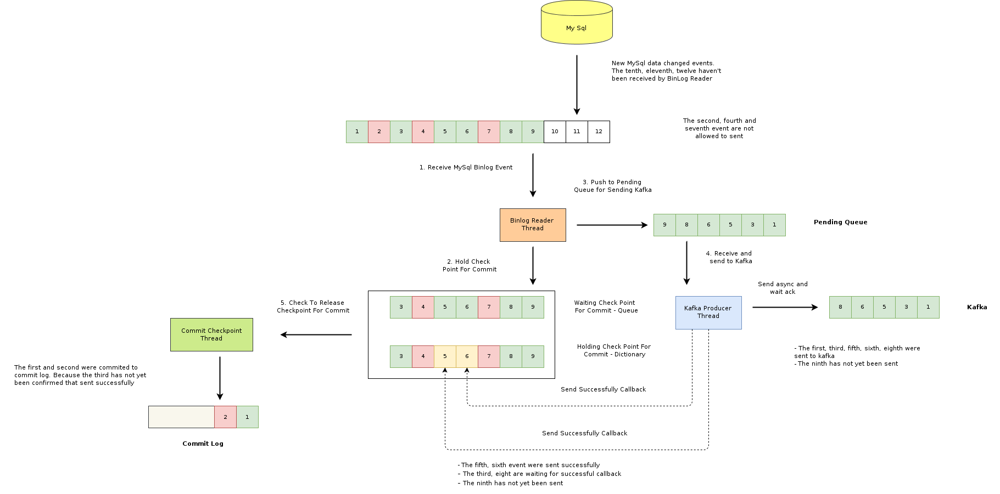

# MySQL Binlog
A Golang application to track all data changes and stored in Kafka.

## Quick Usage
### Build the Golang code to a binary file
- For linux:
```sh
GOOS=linux GOARCH=amd64 CGO_ENABLED=0 go build -o main
```
- For windows:
```sh
$env:GOOS="linux"; $env:GO_ARCH="amd64"; $env:CGO_ENABLED=0; go build -o main
```
### Run docker-compose
```sh
docker-compose up
```
### Go to Kafdrop to watch data change stored in Kafka
Go to: [http://localhost:9000](http://localhost:9000)

## Workflow


## System Overview

### Data Change Tracking

- **Binlog Storage**: All data changes are recorded in the binlog file. Each entry has a log position, which helps in tracking changes. If the application or server crashes, we can resume from the next log position.

### Message Processing Workflow

1. **Event Data and Commit Log Topics**:
   - We use separate topics for event data and commit logs. The event data topic contains the actual changes, while the commit log topic tracks which messages have been committed.

2. **Message Handling**:
   - Each data change event is pushed into a `waiting queue` and sent to a `pending channel`.
   - A goroutine processes messages from the `pending channel` every 0.1 seconds. Upon successfully sending a message to Kafka, a callback triggers an update in the `commit log hashmap` (using go-cache in this project).

3. **Watcher Goroutine**:
   - A background goroutine (the watcher) tracks which data has been successfully stored in Kafka by monitoring the `commit log hashmap`.
   - The watcher compares the first log position in the `waiting queue` with the commit log. If the first log position has been written, it releases this position from both the `commit log hashmap` and the `waiting queue`.
   - Released log positions are written into the commit log topic.

### Why Both `Commit Log Hashmap` and `Waiting Queue`?

- **Maintaining Order**: We need both the `commit log hashmap` and the `waiting queue` to maintain message order when producing to Kafka. This ensures that messages are processed in the correct sequence.
- **Handling Failures**: Without maintaining order, a failure could result in skipping events. For example, if messages 3 and 4 are sent to Kafka and only message 4 is successful, a crash could lead to message 3 being missed upon restart. The system would only see message 4 in the commit log topic and would not resend message 3.
- **Handling Duplicates**: The primary concern with this approach is handling duplicate events. If an event is processed more than once, it can be skipped safely, as duplicates do not cause errors in the system.

## TODO:
- [ ] Get last offset in Kafka after re-start
- [ ] Write new binlog reader (currently this project using [canal](https://github.com/go-mysql-org/go-mysql?tab=readme-ov-file#canal))